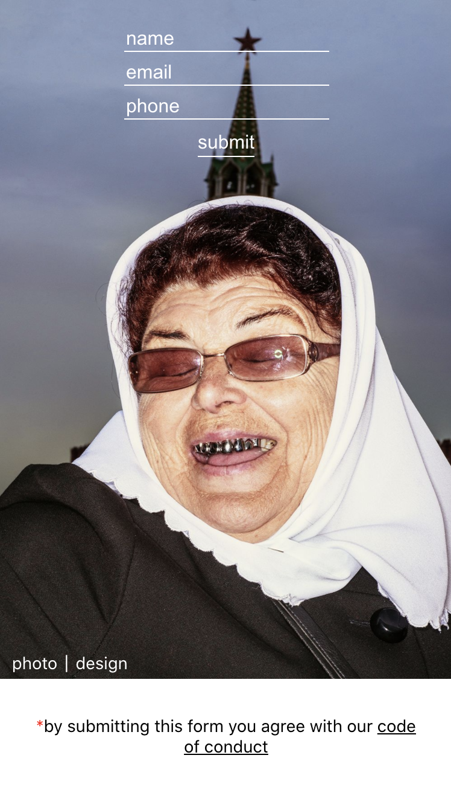

# Trace Me Russki

To prevent the spread of coronavirus, Victorian Government obliged every event organiser to 
keep electronic records of all visitors. 

This app is made upon React framework and Netlify forms.

You can view the build by following [the link](https://tracr.netlify.app)

<h2>Website Screenshots</h2>

	

